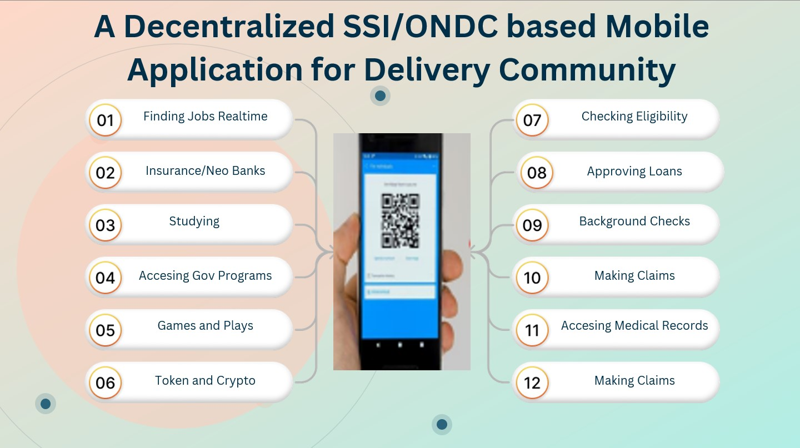
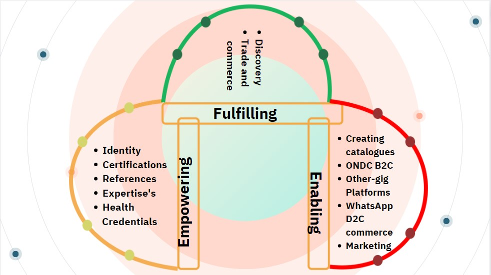

## Team:- DrivingProgress
##  Title Maximize Driver potential on and off the road
##  Driver Empowerment Skilling Development 

## Problem 
1. Lack of clarity on career planning
2. Lack of opportunities to upskill or retraining
3. Driver's resistance to change.
4. No immediate access to work / personal data needed for insurance/loans etc
5. Social well being
6. Driver's resistance to change.

## Solution 
1. A Next generation decentralized SSI / ONDC based Mobile app for driver community 
2. Providing new internet service that delivers a combined identity verification, store data and authentication solution
3. Drivers certificate , health , finance, rewards, NFT , Education and delivery detail will be stored in Self soverign identity
4. Using data stored in SSI drivers can apply for Goverment loans /courses such as PMKVY NSDC and PMMY.

## How to Install
1.  Clone the Repo or Download the Source File
2.  Transfer the both apk file from APK Folder to Android Phone
3.  Install the Application.

## Try Here
https://drive.google.com/file/d/1IQcSaD8CFH9KuvueyLYFpT3IDy2pbQvB/view?usp=share_link

