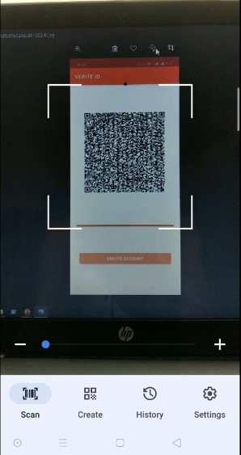
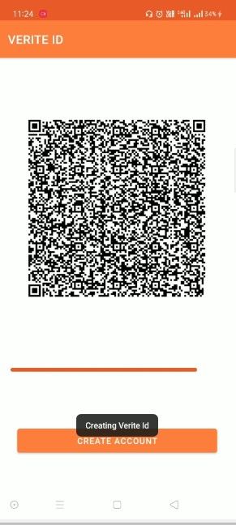
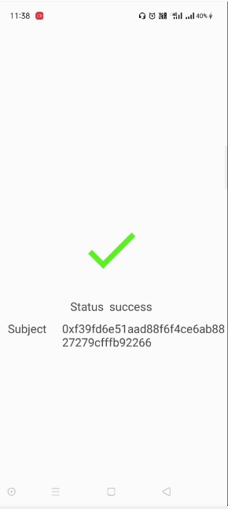
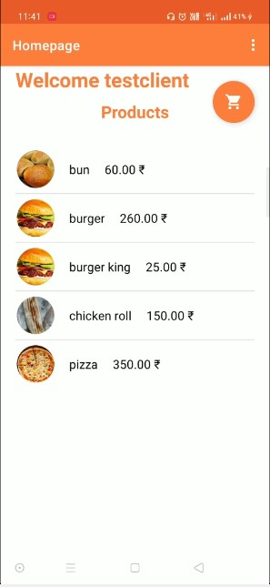
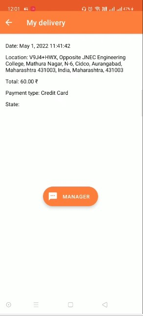

## What is CEEDI 
In very simplistic term CEEDI is an Decentralized Restaurant Android Application enabled with WEB3 identity service Vertie.

Gig Workers can be onboarded quickly and can be verified with CEEDI Scanner

User can make order where it goes to restaurant manager and from there he assign to rider.

Rider data such as number of delivery payments etc are stored in Verite Id which can be used to apply for loan or where there is identity verification authentication is required.

## What is CEEDI SCANNER 

CEEDI SCANNER is enabled with Verite service to verify the user identity user have to scan the QRCODE to verify the identity it is forked from https://github.com/D4rK7355608/com.d4rk.qrcodescanner and modified according to purpose 

## How to Install
1.  Clone the Repo or Download the Source File

2.  Transfer the both apk file from APK Folder to Android Phone

3.  Install the Application.

## Verite Implementation
https://github.com/abhijeet0401/2022_Circle_Hackathon/blob/main/Ceedirestaurant/app/src/main/java/com/android/deliveryapp/SsiWallet.kt

(Issuer)

https://github.com/abhijeet0401/2022_Circle_Hackathon/blob/main/barcodescannerceedi/app/src/main/java/com/d4rk/qrcodescanner/VerifyingssiActivity.kt

(Verifier)

## Special thanks to Tao and Ying for their support 
